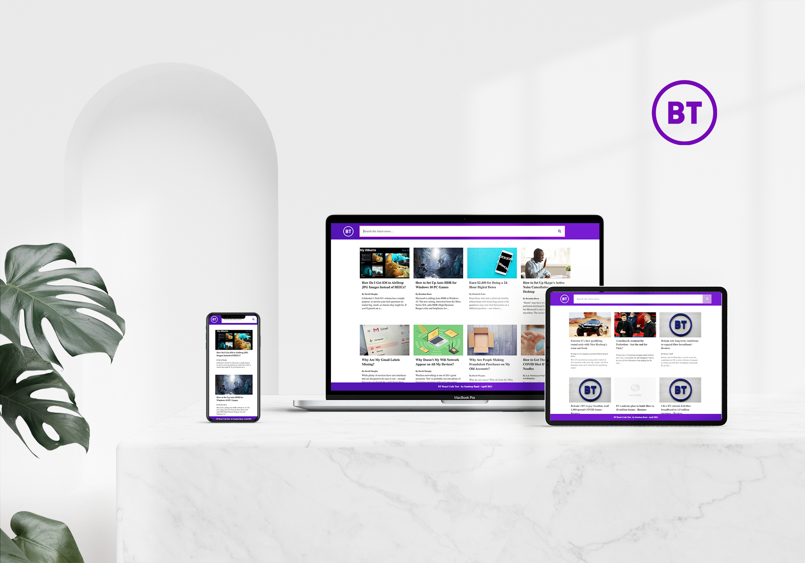

# BT News Api

 

## Description
A responsive website built with react.js and vanilla css, fetching News API data to render articles on user search.

The application allows the user to search for articles, with the displayed set to a maxium of 10 results, and view the full article on the respective external site.

App Summary:
* Search bar functionality
* Fetch API 
* Mobile First Responsiveness

## Table of Contents
- [Preview](#Preview)
- [Execute](#Execute)
- [License](#License)
- [Environment](#Environment)

## Preview

> Please follow the execute instructions below as the News Api has a CORS policy.

#### Demo

#### Mobile Responsive

## Execute
Clone the repo and in the command line run `npm install` or shortcut `npm i` to download all the npm package dependancies, then invoke the application with command `npm run start`.

## Future Developments
* Incorporate lazy load for images
* Add sort by article type feature

## License
MIT

## Environment
* React.js
* Github pages
* NewsApi
* Git
* Visual Studio Code